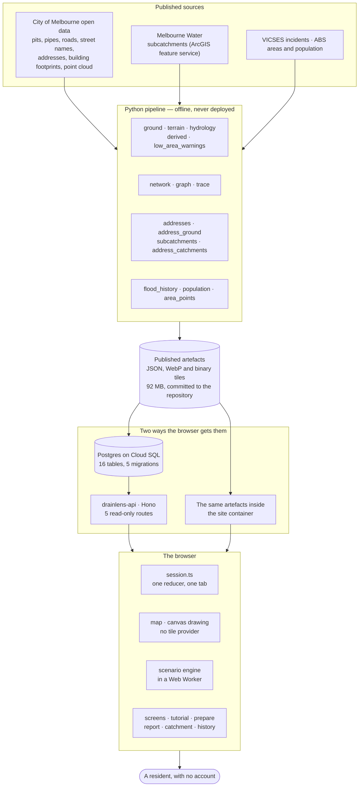

# System architecture, as built

DrainLens · TA28 · **6 October 2026**, Iteration 3 on `develop`

**This file describes the system that exists**, not the one that was planned. The studio's *System Architecture (v5)* is the plan and the three positions below come from it; everything else here was read off the repository on the date above. Where the two disagree, this file is the one that can be checked.

---

## The three positions everything follows from

They are stated first because almost every structural decision below is one of them applied.

**No identity.** No user table, no accounts, no sessions, no email, no retained IP. The address is resolved in the browser against an index shipped with the site, and **no endpoint accepts an address or a coordinate**. What a reader chooses — their address, which places apply to them, what they pinned on a report — lives in one React reducer for the life of a tab and reaches no storage, no URL and no request.

**Build-time heavy, runtime thin.** Every expensive or judgement-laden operation — classifying a point cloud, deriving a bare-earth surface, building a directed graph from an incomplete drainage topology, deciding which drainage area an address is in — runs once, offline, in the Python pipeline, and publishes immutable artefacts. The browser reads those artefacts and does the rest.

**Provenance is a record, not a label.** Every value that reaches the interface carries a basis: a data version, a derivation, an entry in a register, or a model version. `packages/schema` makes `basis` non-optional, so a value that cannot account for itself cannot be constructed.

A fourth follows from the third and is worth stating on its own: **the blockage setting is an assumption the reader supposes**, not a condition anyone observed. The model's independent variable is accumulated rainfall, not time, so it cannot produce a rate — how fast a blockage forms, or how long until water arrives.

---

## The shape of it

The two paths into the browser are the whole availability story, and section 6 is about what happens when the first one is slow.

---

## 1 · The pipeline — `pipeline/`, Python, never deployed

**32 modules**, run by hand from a terminal, publishing into `apps/web/public/data/`. It is not part of the running system: nothing in production imports it, and it has no network listener. It exists so that the browser never has to decide anything expensive or contestable.

| Group | Modules | Produces |
|---|---|---|
| Ground | `las`, `ground`, `terrain`, `terrain_tiles`, `terrain_marks`, `terrain_display` | the measured surface, its tiles, contours and spot heights |
| Water | `hydrology`, `derived`, `low_area_warnings`, `scene`, `scene_tiles` | flow directions, water paths, low areas, pooling markers, the scenario engine's terrain |
| Network | `network`, `graph`, `trace` | pits, pipes, roads, street labels, and the downstream trace with a reason at every path end |
| Places | `addresses`, `address_ground`, `subcatchments`, `address_catchments`, `subcatchment_summary`, `subcatchment_register` | the address index, which way the ground falls at each address, the 35 drainage areas and which one each address is in |
| History | `flood_history`, `population`, `area_points` | the SES incident board, its denominator and the area shapes |
| Support | `geo`, `reframe`, `archive`, `fetch_tiles`, `footprints`, `classification`, `cli`, `flood_thumbnail`, `address_fixture` | projection, moving an artefact between extents, and the plumbing around the rest |

**`geo.py` is the one worth knowing about.** It holds MGA Zone 55 in both directions and agrees with the eastings and northings the City of Melbourne publishes beside latitude and longitude across all 63,721 address records. `apps/web/src/map/mga.ts` is a port of it, tested against values taken from the Python, because a report that pins a location has to leave the browser as degrees.

## 2 · The artefacts — the contract between the halves

Everything under `apps/web/public/data/` is a build product, **committed rather than ignored**, so the front end runs from a clone with no Python toolchain and no network. 92 MB in all; the two tile packs are most of it and neither loads on a first visit.

The per-file list, with sizes and what reads each one, is [INTERFACE-CONTRACT.md](./INTERFACE-CONTRACT.md). Two properties matter architecturally:

- **Everything is in metres from its own extent's south-west corner**, not in degrees. `reframe` moves an artefact between frames, which is how Kensington's derived layers can be drawn on the council map.
- **An artefact is replaced, never edited.** A rebuild writes the whole file, and the checks in `tools/data/` compare the published files against each other rather than against a memory of what they used to say.

## 3 · The database and the API — `db/`, `apps/api/`

**Postgres on Cloud SQL, 16 tables, 5 migrations** (`001_init` through `005_pipe_operator`). The schema is the migrations; [DATABASE-DESIGN.md](./DATABASE-DESIGN.md) explains the decisions rather than copying them.

`apps/api` is **Hono on Node with `pg`**, and it is read-only:

| Route | Returns |
|---|---|
| `GET /health` | the counts it can see, which is how a deployment is verified |
| `GET /api/map/:extent` | pits, pipes, roads, street labels |
| `GET /api/derived/:extent` | water paths, low areas, unmeasured ground |
| `GET /api/trace/:extent` | downstream links and the reason each path ends |
| `GET /api/flood-history` | the board and its areas |

**There is no write endpoint and no endpoint that takes an address.** `POST /api/drain-checks` was specified once and never built; the reporting pathway prepares a report and the reader carries it, which is why it needs no server at all.

## 4 · The browser — `apps/web/`, React 19 + Vite

**13 source directories**, each one a question rather than a layer of a framework:

| Directory | Holds |
|---|---|
| `session.ts` | one reducer over the address, the screen, the guide, the scenario and the reader's answers — the single place the no-identity rule is enforced and tested |
| `address/` | normalisation, scoring and a resolve with four outcomes; runs against the bundled index and never calls the network |
| `map/` | the viewport transform, hit testing and canvas drawing; **no map tile provider** — roads, pipes, pits and labels are drawn from the artefacts |
| `trace/`, `scenario/`, `crosssection/` | the downstream walk, the comparison and what a section may claim about one pit |
| `tutorial/` | six guides held as data: a lesson is steps, each with a requirement the map can satisfy |
| `catchment/`, `prepare/`, `report/` | Epic 6's drainage area, Epic 5's before-rain places and plan, and the reporting pathway with its channel register |
| `history/` | the flood board, its refusals, and the flood map of all 281 areas |
| `screens/`, `ui/`, `data/` | the screens themselves, one name for each thing (`ui/terms.ts`), and where an artefact comes from |

**The scenario engine runs in a Web Worker** (`scenario/worker.ts`, `packages/scenario`), because solving a 500 × 500 grid twice would otherwise stop the map from drawing. The engine has no DOM dependency at all, which is what lets it be tested as pure arithmetic.

## 5 · The shared packages — `packages/`

- **`schema`** — provenance, vocabularies, the scenario types and the wire payloads. The frontend, the backend and the pipeline's output share one definition, so a decision made there cannot drift between them. It is the highest-value directory in the repository for that reason.
- **`scenario`** — routing, depressions, drains and the comparison. No DOM, no React, no fetch.

## 6 · How the browser gets its data, and what happens when it cannot

`data/source.ts` asks the API first and falls back to the copy inside its own container. Three things make that a design rather than a retry loop:

- **`fetchTogether`** — the map, the derived layers and the trace must all come from the same side. A council map drawn with a Kensington trace is worse than either alone.
- **A 4-second timeout** (`API_TIMEOUT_MS`), after which the bundled Kensington square is used and **the footer says so**. The reader is never shown a smaller map without being told.
- **The fallback is for the whole page load.** It does not retry in the background, and it does not half-switch.

> **Measured on 4 October 2026, and worth knowing before a demonstration.** The API runs at `--min-instances=0`, so after an idle period the first request pays for a cold start — 0.74 s on `/health`, but enough under load for the page's own fetch to miss the 4-second timeout. The first visitor after a quiet hour can land on the Kensington square, and it stays that way until they reload. Opening the site once before a demonstration is enough to avoid it; `--min-instances=1` is the paid alternative. See [DECISIONS-PENDING.md](./DECISIONS-PENDING.md) §9.

## 7 · What checks it — `tools/`, `.github/workflows/ci.yml`

Four CI jobs: **check**, **pipeline**, **database**, **security**. The first is where the architecture is actually defended:

- **9 data checks** in `tools/data/` assert things no unit test can see, because they are claims about *published files*: that every address the guide can be given has a recorded inlet with a path onward within 200 m; that the three area artefacts still describe the same areas; that both copies of the derived layers agree; that every pipe operator value is one the mapping explains; that every address matches one drainage area or none.
- **`tools/docs/check.mjs`** reads the 32 tracked markdown files for broken structure and broken relative links, and every tracked text file for a raw NUL byte.
- Coverage thresholds are enforced in `vitest.config.ts` and `pipeline/pyproject.toml`. **The test counts live in one place — the quality-gate table in the root [README](../README.md)** — because every prose restatement of them has gone stale.

## 8 · Deployment — `deploy/`, Cloud Run

**Five services, one role each**, which is the closest thing Cloud Run offers to the studio's subdomain pattern:

| Service | Built from | Holds |
|---|---|---|
| `drainlens` | `main` | the latest completed iteration — Iteration 2 since 28 September |
| `drainlens-dev` | `develop` | the iteration being built |
| `drainlens-iteration1`, `drainlens-iteration2` | the frozen tags | each completed iteration, deployed once and left alone |
| `drainlens-api` | its own image | the read-only API, with Cloud SQL and a secret-backed `DATABASE_URL` |

**The site container has no application server.** `Dockerfile` builds the site and serves it with nginx: static files, content types, gzip and cache policy, with the base image **pinned by digest** so two builds of one commit cannot ship different operating-system packages. All four site services sit behind one basic-auth gate, because an unlisted URL is not a gate and a half-built iteration is exactly what should not be found by accident.

A deployment is run by hand by the team member holding the credentials — never from CI, never by a script. The runbook, and the two mistakes made getting there, are in [deploy/README.md](../deploy/README.md).

## 9 · The assistant prototype — `assistant/`, not part of the running system

A local RAG prototype for Stage 2 evaluation: Streamlit, ChromaDB, and **Ollama with `llama3.2` running on the operator's own machine**. It is in the repository for its evidence — 30 questions, the scored results, and a source register — and is **not deployed, not linked from the product, and not reachable from any of the five services**. The documents it reads live in the git-ignored `data/` directory; what is committed is the code and the evaluation.

---

## What is deliberately absent

Each of these is a decision, not a gap:

| Not here | Because |
|---|---|
| User accounts, login, any user table | the first position. Nothing the product does needs to know who is asking |
| A submit endpoint for reports | DrainLens prepares a report; the reader sends it. A submit button would make this project a party to a council's workflow it has no agreement with |
| Analytics, tag managers, third-party scripts | the site's content-security policy allows scripts from itself and the API and nothing else |
| A map tile provider | the map is drawn from the council's own records; a basemap would put somebody else's cartography under claims this project has to stand behind |
| Server-side rendering, an application server for the site | there is nothing to render that is not already a build product |
| Live rainfall, forecasts, warnings | the product says plainly that it is none of those, and an endpoint that fetched them would make the sentence false |

---

## Where the detail lives

| Question | File |
|---|---|
| How is the water routed, end to end? | [ALGORITHMS.md](./ALGORITHMS.md) |
| What exactly does the browser load? | [INTERFACE-CONTRACT.md](./INTERFACE-CONTRACT.md) |
| Why is the schema like that? | [DATABASE-DESIGN.md](./DATABASE-DESIGN.md) |
| Where did each dataset come from, under what licence? | [DATASETS.md](./DATASETS.md) |
| How do I run and build it? | [DEVELOPMENT.md](./DEVELOPMENT.md), [pipeline/README.md](../pipeline/README.md) |
| How is it deployed and verified? | [deploy/README.md](../deploy/README.md) |
| What is still undecided? | [DECISIONS-PENDING.md](./DECISIONS-PENDING.md) |

## Version history

| Version | Date | Change |
|---|---|---|
| 1.0 | 6 Oct 2026 | Written from the repository as it stands on `develop` at Iteration 3: six guides, the preparation plan, the reporting pathway, the drainage areas, five Cloud Run services and the assistant prototype beside them. |
